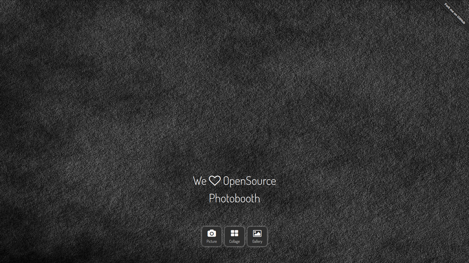

<a href="https://photoboothproject.github.io" class="button hidden">Home</a>
<a href="https://photoboothproject.github.io/Changelog" class="button hidden">Changelog</a>
<a href="https://photoboothproject.github.io/INSTALL" class="button hidden">Install</a>
<a href="https://photoboothproject.github.io/FAQ_MENU" class="button hidden">FAQ</a>

[](https://t.me/PhotoboothGroup)   [](https://crowdin.com/project/photobooth)

_Latest stable release:_

[](https://github.com/PhotoboothProject/photobooth/actions?query=branch%3Astable4+workflow%3ALint)
[](https://github.com/PhotoboothProject/photobooth/actions?query=branch%3Astable4+workflow%3Agulp-sass)
[](https://github.com/PhotoboothProject/photobooth/actions?query=branch%3Astable4+workflow%3ABuild)

_Latest development version:_

[](https://github.com/PhotoboothProject/photobooth/actions?query=branch%3Adev+workflow%3ALint)
[](https://github.com/PhotoboothProject/photobooth/actions?query=branch%3Adev+workflow%3Agulp-sass)
[](https://github.com/PhotoboothProject/photobooth/actions?query=branch%3Adev+workflow%3ABuild)

---



---

## Contribute to this Webpage

Clone the _PhotoboothProject.github.io_ project from github. Run the following commands from your Terminal:

```sh
git clone https://github.com/PhotoboothProject/PhotoboothProject.github.io.git
cd PhotoboothProject.github.io
```

Make your changes, upload them to your fork and create a [pull request](https://github.com/PhotoboothProject/PhotoboothProject.github.io/pulls).

---

## Changelog

View all version changes [here](Changelog).

---

## News

### 28 November 2022

Photobooth v4.3.0 released!

Some minor bugs have been fixed, build dependencies have been updated, new Features have been added.


Like always: The full Changelog can be found [here](Changelog).

Enjoy Photobooth v4.3.0!

---

### 16 October 2022

Photobooth v4.2.0 released today!

Some minor bugs have been fixed, PHPMailer and build dependencies have been updated.


The full Changelog can be found [here](Changelog).

Enjoy Photobooth v4.2.0!

---


### 30 September 2022

We're proud to release Photobooth v4.1.0!

Some bugs have been fixed, some new features have made it's way into the new version and some code have been cleaned.

Logging is added to save and reset actions via Adminpanel for easier debugging.

The full Changelog can be found [here](Changelog).

Enjoy Photobooth v4.1.0!

---

### 10 September 2022

We're proud to release Photobooth v4.0.0 with the code switch to PhotoboothProject which contains a lot of Bugfixes and user-wishes could be integrated.

Photobooth v4.0.0 comes in a new _**modern squared**_ look!

Overall the code got optimized and cleaned up. There's also a lot of new options added.

Photobooth is now again compatible with Windows, also PHP8 won't cause trouble.

The full Changelog can be found [here](Changelog).

If you find a bug you're welcome to report it on the [GitHub issue page](https://github.com/PhotoboothProject/photobooth/issues).

New Images with preinstalled Photobooth will be available next days.

[Update instructions](Update-Photobooth) have been updated, you can now easily update your existing git installation of Photobooth using the photobooth installer!

Enjoy Photobooth v4.0.0!

---

### 17 August 2022

Photobooth source moved!

We’re proud to announce that our Photobooth Source moved to [https://github.com/PhotoboothProject](https://github.com/PhotoboothProject) for the upcoming Photobooth release!

Currently we’re preparing this webpage for you with all needed information. Also update/upgrade information will be available once the new release is out.

Stay tuned!

---

